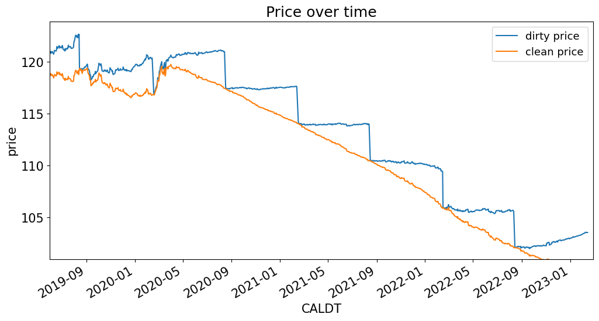
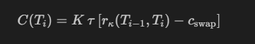
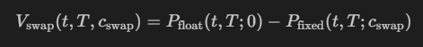
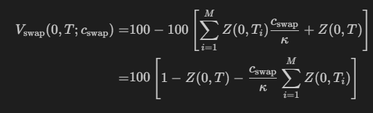
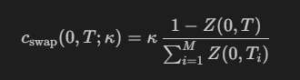

# Week 1: Spot and Discount Curve 

## HW1

### Discount Curve

- For **boostraping**, we need a perfect defined matrix n x n:

``` Python

RESTRICT_YLD = True
RESTRICT_TIPS = True

RESTRICT_DTS_MATURING = True
RESTRICT_REDUNDANT = True

data = filter_treasuries(quotes, t_date=t_current, filter_yld = RESTRICT_YLD, filter_tips = RESTRICT_TIPS, drop_duplicate_maturities=RESTRICT_REDUNDANT)
CF = filter_treasury_cashflows(calc_cashflows(data),filter_maturity_dates=RESTRICT_DTS_MATURING)
```


- For **OLS**: We have more than one bond in a specific maturity (overdefined system), but we avoid having dates with no payments (if not, the regression is going to be close unidenfieed due to multicolinearity, so it will have extrem values on those maturities)

``` Python

RESTRICT_YLD = True
RESTRICT_TIPS = True

RESTRICT_DTS_MATURING = True
RESTRICT_REDUNDANT = False

data = filter_treasuries(quotes, t_date=t_current, filter_yld = RESTRICT_YLD, filter_tips = RESTRICT_TIPS, drop_duplicate_maturities=RESTRICT_REDUNDANT)
CF = filter_treasury_cashflows(calc_cashflows(data),filter_maturity_dates=RESTRICT_DTS_MATURING)
```

- **Nelson-Siegel Model**: In this case, we could have both, a system where in an specific maturity have more than one bond and dates with not payments, N-S create a more smooth curve 


``` Python

RESTRICT_YLD = True
RESTRICT_TIPS = True

RESTRICT_DTS_MATURING = False
RESTRICT_REDUNDANT = False

data = filter_treasuries(quotes, t_date=t_current, filter_yld = RESTRICT_YLD, filter_tips = RESTRICT_TIPS, drop_duplicate_maturities=RESTRICT_REDUNDANT)
CF = filter_treasury_cashflows(calc_cashflows(data),filter_maturity_dates=RESTRICT_DTS_MATURING)
```

- **Comments**: **Boostrap** will price perfectly in-sample and **N-S** can easily extend to arbitrary maturities and generate a smoother forward rates 

- When the interest rate change, impacting the discount curve and coupons, the effect are nearly offsetting (example fo floating rate notes)

- The months with more payments (in Treasury Notes (2-10y) and Bond (20,30y)) are in Feb, May, Aug and Nov.


## Discussions

- Accrued interest: Based on the days until the next coupon 

$$ AccrInt = \frac{\text{days counted}}{\text{days in ref. period}}*\text{Interest on ref. period} $$

- Dirty price = Clean price + Accrued interest. In the market (Bid/Ask), the published price is the clean price. For **Spot curve construction we should use the dirty price!** 



- Return vs YTM:
    They are equivalent iif:
        - We are discussing about a zero-coupon bond (T-Bills)
        - The investor holds until maturity
    If not:
        - It isn't a return, as there is not guarantee you can re-invest intermedite cash-flows (coupons) at the YTM

### Curves 

- **Yield to Matirity**: Pricing a particular bond (Treasury) using the Yield to Maturity( YTM), for a particular security (Plot: YTM/ Time to Maturity (TTM)) -> It can be used as a discount rate **only** that specific bond

- Zero coupon bond: Usually there is not in the market, it is useful to create the discount rate directly using its prices (STRIS)

- **Spot curve:** Approach using bonds in the market to get the spot discount curve

- **Discount curve**: It does not depend on the compounding frequency of the rate, is unique

$$Z(t,T) = \frac{1}{(1+\frac{r_n}{n})^{n(T-t)}} = e^{-r(T-t)} $$

For continous compounding from the discount curve

$$r(t,T) = -\frac{\ln\left(Z(t,T)\right)}{T-t}$$

### Yield-Curve Factors

- **Level**: mean of the different maturities
- **Slope**: Long-term yield (10y or 30y) minus short-term yield
- **Curvature**: Mid-range yield (5y or 10y) minus short-term yield minus long-term yield.

### PCA

- PCA gives linear combinations of interest rates along the curve wich have maximum explanatory power in its variation
- Generate a linear combination of the differents maturities of the yield cuve that are orthoganal to each other
- The first components explains almost all the variance (~97%) and the first 3 components around the 99% of the variance
- The first three PCs are interpretable as Level, Slope and Curvature. This is an empirical result! 

--------------

# Week 2: Duration and Convexity 

## HW2

### Arbitrage two bonds:

- We take a **long position** on the bond with **max(YTM)** ; **Short position min(YTM)**
- The bond with the **largest duration**/**Lower coupon**, will have **higher convexity**, so the approximation using only duration will be less accurate
- Risks:
    - **Long-term**: By taking a long (max(YTM))/short position (min(YTM)), if we held to maturity, the return will be guaranteed giving the difference of YTM
    - **Short-term**: Giving the fluctuation of the spot curve (mkt movements), the YTM spread could diverger and generate losses, giveng the leverage (repo) this could generate a preasure to close the position (unwind)

- **Hedge ratio**
    * $n_i$: number of bonds purchased (or sold)
    * $D_i$: duration of bond $i$
    * $D_{\$,i}$: dollar duration of bond $i$, equal to $p_iD_i$

$$0 = n_iD_{\$,i} + n_jD_{\$,j}$$

$$n_j = -n_i\frac{D_{\$,i}}{D_{\$,j}}$$

## Discussions

- We **don't use regressions** to estimate the sentitivities of the bond prices to the change of the rate, given:
    - Over timeseries, maturitues changes [ie, 12M move to 11M]
    - We have a clear mathematical formula to estimate it 
- Taylor approximation: 

    $$\begin{align}
    \frac{dP}{P} \approx -D\times dr + \frac{1}{2}C\times (dr)^2
    \end{align}$$
    where 
    * $dr$ is a small change in the level of the spot curve
    * $D$ is the **duration**
    * $C$ is the **convexity**

### Duration

$$\begin{align}
D \equiv -\frac{1}{P}\frac{dP}{dr}
\end{align}$$

$$
\frac{dP}{P} \approx -D\times dr
$$

- Sensitivity to the **level** of the interest rate curve
- **Parallel shift** of the spot curve
- For zero-coupon bonds, Duration = Maturity ; For coupon bonds, Duration < Time-to-Maturity
- A higher coupon decrease the duration 
- Linear approximation, good for small changes on the rates. **Duration always underestimate the actual price**

$$\begin{align}
D_{\text{zero}} \equiv -\frac{1}{P(t,T,0)}\frac{dP(t,T,0)}{dr} = T-t
\end{align}$$

- The **duration of the coupon bond** is the weighted average of the cashflow maturities:

$$\begin{align}
D_{\text{coupon bond}} \equiv& \frac{1}{P(t,T,c)}\frac{dP(t,T,c)}{dr}\\
=& \sum_{i=1}^n w_iD_i\\
=& \sum_{i=1}^n w_i T_i
\end{align}$$

#### Others durations

- **Dollar duration**: Dollar change in the price, instead of a percentage change

$$\begin{align}
\text{dollar duration} = D_{\$} \equiv -\frac{dP}{dr}
\end{align}$$

- **Macauley Duration**: Sensitivity to a parallel shift in the **spot curve**, it's the one defined above 

- **Modified Duration**: It is used to calculate the change in the price given a change in the **YTM** of the bond

$$\begin{align}
\text{modified duration} \equiv D_{\text{ytm}} \equiv &  \quad \frac{1}{1+y/2} D \\
=&  -\frac{1}{1+y/2}\frac{1}{P}\frac{dP}{dr}
\end{align}$$

### Convexity 

Second order approximation, refer to the change of the convexity of the spot curve. It is alwaysd positive.

$$\begin{align}
\frac{dP}{P} \approx -D\times dr + \frac{1}{2}C\times (dr)^2
\end{align}$$

where $C$ denotes the convexity of the bond,

$$\begin{align}
C \equiv & \frac{1}{P}\frac{d^2P}{dr^2}
\end{align}$$

- For a zero coupon bond, it is the squared of the time to maturity

$$\begin{align}
C =& \frac{1}{P(t,T,0)}\frac{d^2P(t,T,0)}{dr^2}\\
=& (T-t)^2
\end{align}$$

$$\begin{align}
C =& \sum_{i=1}^n w_iC_i
=& \sum_{i=1}^n w_i(T-t)^2
\end{align}$$


---------------------------


# Week 3: Floating-Rates Notes and Swaps

## Discussions

### Floating-Rates Notes (FRN)

- Pay coupons based on a specific variable (floating) short-term rate (r) and pre-sprecified spread (s). And it pays a Face Value + coupon at the maturity

- On the coupons dates (or **reset dates**), the Note pays the coupon and the following rate (for the next period) is set

$$\begin{align}
cpn_{T_i} = 100 (r(T_{i-1},T_i) + s)
\end{align}$$

Note that
- This coupon is annualized, so the payment is $cpn_{T_i}/freq$, similar to how the vanilla treasury coupon was divided by 2.
- This coupon is based on the **rate in arrears**. Thus the coupon paid at $T_i$ depends on the rate at $T_{i-1}$.
- The spread, $s$, is fixed over the life of the bond. The coupon only "floats" due to $r$, not $s$.


- Return FRN vs Fixed rate bonds: 
    - R FRN > R Fixed (riging rates periods)
    - R FRN < R Fixed (falling rates periods)

- The price of a FRN with zero spread at reset date is equals to its face value

$$price_{float}(T_i,T;0) = 100$$


### Swaps

- Components: Notional, fixed rate ($C_{swap}$), floating rate (short-term variable rate: SOFR or FED), frequency (k), maturity
- CashFlow at each period (Paying fixed) (where tau = 1/k): 



- No cost to initiate

- Replication with bonds (paying-fixed swap): Short fixed-rate bond and Long FRN 

- Swap Value:



At the begining, floating bond = 100 



Solving for the fixed rate: 



- **Negative Swap Spreads**: ($\text{Swap Spread} = \text{Swap rate} - \text{fixed rate bond}$)
    Nowadays (after the financial crisis of 2008), the swap spread in the US Market is negative, giving that the floating rate (SOFR) is a collateralized lending rate, the regualtions to higher capital requirements, Swap now (usally) goes through a Central Clearing House, eliminting the counterparty risk.


---------------------------

# Week 4: Forwards 


## Fwd Formula

Interest rate in a future time (from T1 to T2)

- Forward Discount Factor: 

$$ t \le T_1 \le  T_2$$
$$\begin{align}
F(t,T_1,T_2) = \frac{Z(t,T_2)}{Z(t,T_1)}
\end{align}$$

- Forward Discount Rate:

$$\begin{align}
f(t,T_1,T_2) \equiv & \quad -\frac{\ln\left\{F(t,T_1,T_2)\right\}}{T_2-T_1}\\[6pt]
F(t,T_1,T_2) = & \quad e^{-f(t,T_1,T_2)(T_2-T_1)}
\end{align}$$

- With a N-S spot curve, we can obtain a more smooth fwd curve

- Spot curve vs Fwd Curve: The fwd curve is above (bellow) the spot curve iif the spot curve is sloping upward (down)


$$\begin{align}
f(0,T,T+\Delta) = r(0,T) + (T+\Delta)\,\underbrace{\frac{r(0,T+\Delta)-r(0,T)}{\Delta}}_{\text{slope of spot curve}}
\end{align}$$


- From Fwd Rates to Spot Rates: 

$$\begin{align}
r(0,T_n) = \frac{1}{T_n}\sum_{i=1}^nf(0,T_{i-1},T_i)\Delta
\end{align}$$

where 
* $T_0=0$, 
* $f(0,0,T_1) = r(0,T_1)$.

```Python 

QUOTE_DATE_ALT = '2006-12-29'

display(f'Quote Date: {QUOTE_DATE_ALT}')
curves_imputed = curves_set[QUOTE_DATE_ALT][['forward rate']]
curves_imputed.columns.name = QUOTE_DATE_ALT

mat_grid = curves_imputed.index.to_series()
delta_grid = mat_grid.diff()
# assuming first delta is same as second delta
delta_grid.iloc[0] = delta_grid.iloc[1]

curves_imputed['spot rate'] = (curves_imputed['forward rate'] * delta_grid).cumsum(skipna=True) / mat_grid ## sum{f*delta}/T
curves_imputed['spot rate'].iloc[0] = curves_imputed['forward rate'].iloc[0]

```

## Forward Rate Agreements (FRA)


- Key charasteristics: 
    - Not capital exchange 
    - One party pays a fixed interesnt from T1 to T2 (fwd rate)
    - The other part pays a spot rate (floting, defined at T1)

$$\begin{align}
& \quad N \Delta\left[f_n(0,T_1,T_2)-r_n(T_1,T_2)\right]\\[6pt]
\Delta \equiv & \quad T_2-T_1\\[6pt]
N \equiv & \quad \text{Notional Investment}
\end{align}$$

## Yield curve 

- Term spread: The slope of the yield curve, long-term minus short-term (typically 10y - 3m, but given that they are highly correlated (~90\%), the results wouldn't be substantively different)

- A negative term spread has preceded avery recession since the mid 20th century. It has das only one "false alarm"

- According to the paper, the absolute level of the term spread is more important than its change. However, changes in the spread become significant when the level is already low, regardless of whether the shift is driven by short or long-term rates.

- Sacks equations for **Term premium**

$$ i_t^{10} = \frac{1}{10}\sum_{j=0}\mathbb{E_t}[i_{t+j}^1] + \text{tp}_t $$ 
$$ i_t^{10} - i_t^{1} = \sum_{j=0} \frac{10-j}{10} \mathbb{E_t}[\Delta i_{t+j}^1] + \text{tp}_t $$ 

- Term premium (tp): risk premium that the investors demand for taking a long-term insterest instead of rolling over the short-term rate 
- Changes in the term spread may be driven by shifts in the term premium rather than changes in expected short-term rates